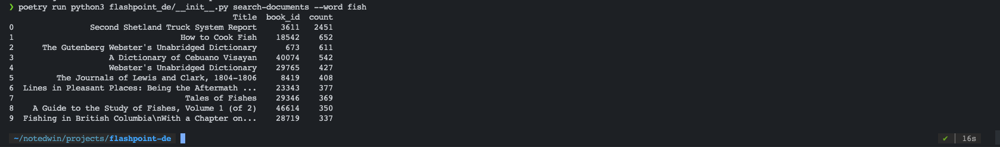
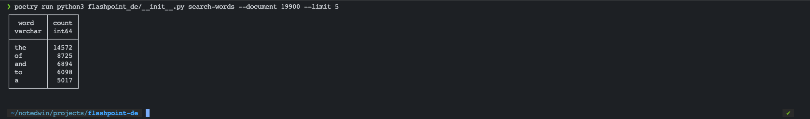

# Flashpoint Data Engineering

Instructions:

- Index 10 books from Project Gutenberg
- Create CLI to determine frequency of a word per book.
- Rank books by frequency given a word

Examples:

- ./search_words.py 19900-8 --limit 5 # Returns the 5 most frequently used words in
  document 19900-8.
- ./search_documents.py fish -—limit 5 # Returns the 5 documents where "fish" shows up
  most frequently.

## How to run?

```bash
docker build -t guten --rm .
docker run -it --name guten --rm guten

# then either
python3 flashpoint_de/__init__.py search-words --document 19900 --limit 5
# or
python3 flashpoint_de/__init__.py search-documents --word fish
```

## Does the algorithm work in such a way that it can be scaled (example: to process the entire Project Gutenberg’s library)?

I can currently process all of the entire Project Gutenberg’s library (71,879 txt files) on my laptop as I ran my code on 52,000 txts. The longest part is getting the data downloaded and into a SQL database which takes about 10 minutes to download and unzip on my 100MBPS download speeds and 20 minutes to get counts for every book into duckdb.

## Imagine running it on multiple machines with different documents: how do we query across multiple machines?

To run this code across multiple machines, we would need to change the code to process the data a little by adding code to send the result to a centralized database or to query across each machine when a query is made.

## Notes

Initally, I wrote both search_words and search_documents and manually tested it with 10 books. However, I knew I wanted to write this for the whole Project gutenberg corpus since I had quickly impletented fuzzy searching with the help of the catalog provided by project gutenberg.

They however do not provide a single download for all txt files so I had to do some research and I came across this zip file.

https://github.com/aparrish/gutenberg-dammit

This is not the whole corupus but it is all of the books up to 2018, which was good enough for now!

For both CLI commands there is a security concern here, I would need to sanitize input or you could do a SQL injection.

Implemented fuzzy searching:

Automated setup is a python extract.py + bash script + dockerfile.

## Interesting Technologies

I used duckdb becuase of my experience with SQL and feeling comfortable doing data manipulation in SQL. I also benefit from the performance of duckdb.

## Interesting Notes

The original files are 18GB but once word counts are in DB, the DB file is 5.56GB!

The books don't need to be moved unless its updating data, we can move around the file.db as it has all the information.

Doing a setup with a 16GB data set takes a while to test!

## Additonal features I wanted to add

Automated testing!
Query caching for search_documents since it makes alot of queries.
Added a simple web interface or API.

## Pictures



